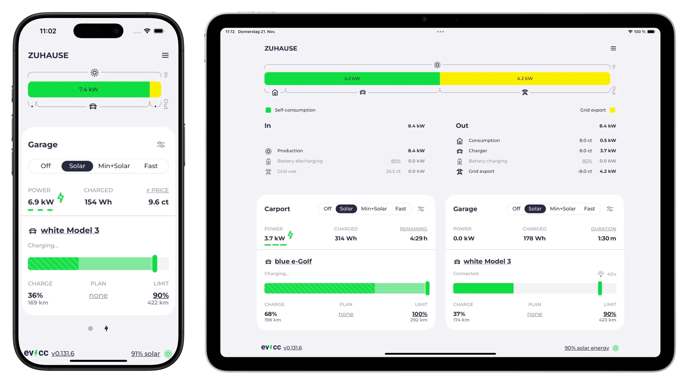

<p align="center">
  
</p>

<h1 align="center">evcc hub</h1>

<p align="center">
  Cloud-Dashboard für <a href="https://github.com/evcc-io/evcc">evcc</a> — deine Ladestation von überall im Blick.
</p>

---

**evcc hub** ist ein Community-Projekt und bietet ein gehostetes Cloud-Dashboard für [evcc](https://evcc.io). Deine lokale evcc-Instanz sendet Daten per MQTT an evcc hub, und du kannst dein Dashboard von unterwegs abrufen — ohne VPN, ohne Portfreigabe.

> **Hinweis:** Dies ist kein offizielles Projekt von evcc.io. evcc hub baut auf evcc auf und setzt eine laufende evcc-Installation voraus.

<p align="center">
  
</p>

## Features

- **Remote-Zugriff** — Dein evcc-Dashboard von überall erreichbar
- **Multi-Site** — Mehrere Standorte (z.B. Zuhause + Ferienhaus) in einem Account
- **Echtzeit-Daten** — Live-Updates per MQTT mit TLS-Verschlüsselung
- **Offline-fähig** — Letzte Daten werden lokal gecacht, auch wenn die Verbindung kurz abbricht
- **Kein Portforwarding nötig** — Deine evcc-Instanz baut die Verbindung von innen nach außen auf

## Schnellstart

### 1. Account erstellen

Registriere dich auf [evcc-hub.de](https://evcc-hub.de) mit E-Mail und Passwort.

### 2. MQTT-Konfiguration in evcc eintragen

Nach der Registrierung bekommst du deine persönliche MQTT-Konfiguration angezeigt. Trage sie in deine `evcc.yaml` ein:

```yaml
mqtt:
  broker: tls://mqtt.evcc-hub.de:8883
  topic: <dein-topic>
  user: <dein-username>
  password: "<dein-passwort>"
```

Die genauen Werte werden dir nach der Registrierung angezeigt.

### 3. evcc neu starten

```bash
sudo systemctl restart evcc
```

Fertig — dein Dashboard ist jetzt unter [evcc-hub.de](https://evcc-hub.de) erreichbar.

## Weitere Standorte hinzufuegen

Unter **Standorte verwalten** kannst du zusaetzliche Standorte anlegen. Jeder Standort bekommt eigene MQTT-Zugangsdaten, die du in die jeweilige `evcc.yaml` eintraegst.

## Self-Hosting

evcc hub ist Open Source. Wenn du den Service lieber selbst betreiben moechtest, kannst du das Projekt mit Docker Compose auf deinem eigenen Server deployen. Die noetige Infrastruktur (Go-Backend, Mosquitto MQTT-Broker, Nginx Reverse Proxy) ist im Repository enthalten.

## Technologie

| Komponente | Technologie |
|-----------|-------------|
| Frontend | Vue 3, TypeScript, Bootstrap 5 |
| Backend | Go, Gin, SQLite |
| MQTT-Broker | Eclipse Mosquitto 2 (TLS) |
| Infrastruktur | Docker Compose, Nginx, Let's Encrypt |

## Lizenz

[MIT](LICENSE) — wie das offizielle evcc-Projekt.

## Danksagung

Dieses Projekt waere ohne [evcc](https://github.com/evcc-io/evcc) nicht moeglich. Vielen Dank an das evcc-Team fuer die grossartige Arbeit an der Open-Source-Ladesteuerung.
